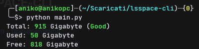

## LS-SPACE-CLI

###### [Installation](#installation-guide)・[Documentation](#Documentation)・[Images](#Screenshot)

### Installation guide

### Manual installation
```bash
git clone https://github.com/aniko33/lsspace-cli.git && cd lsspace-cli && pip install -r req.txt
```

### Automatic installation

```bash
curl https://raw.githubusercontent.com/aniko33/lsspace-cli/main/installation -o installation.sh
```

### Documentation

###### Memory evaluation

The memory is evaluated from green to red which indicate the status of the memory, this is a table where the various gradations are observed

| Color | Gradations |
| --- | --- |
| Green | High |
| Yellow | Medium |
| Red | Low |

**High** means it's good,
**Medium** means that it is neither bad nor good,
**Low** means that it is really bad
### Screenshot

